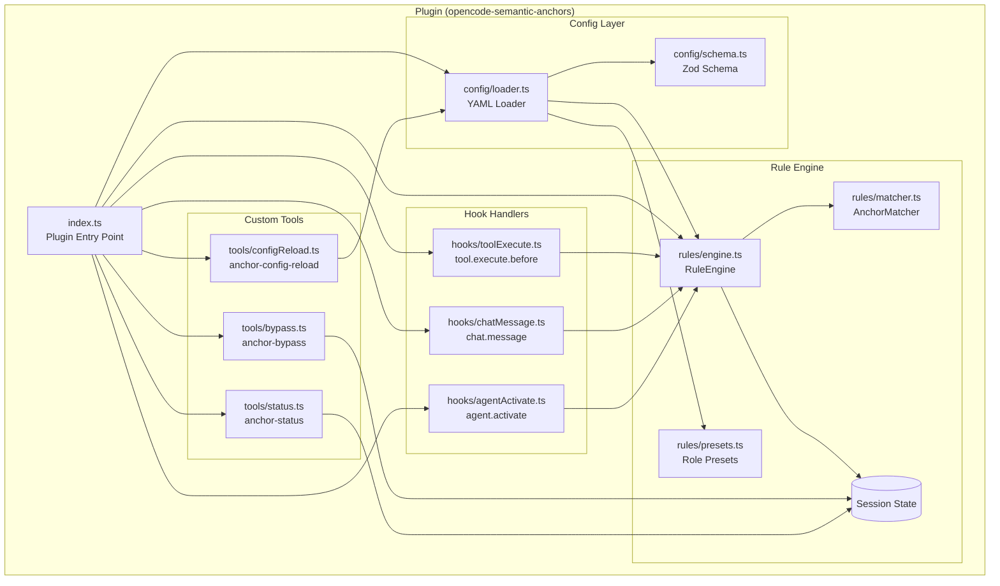
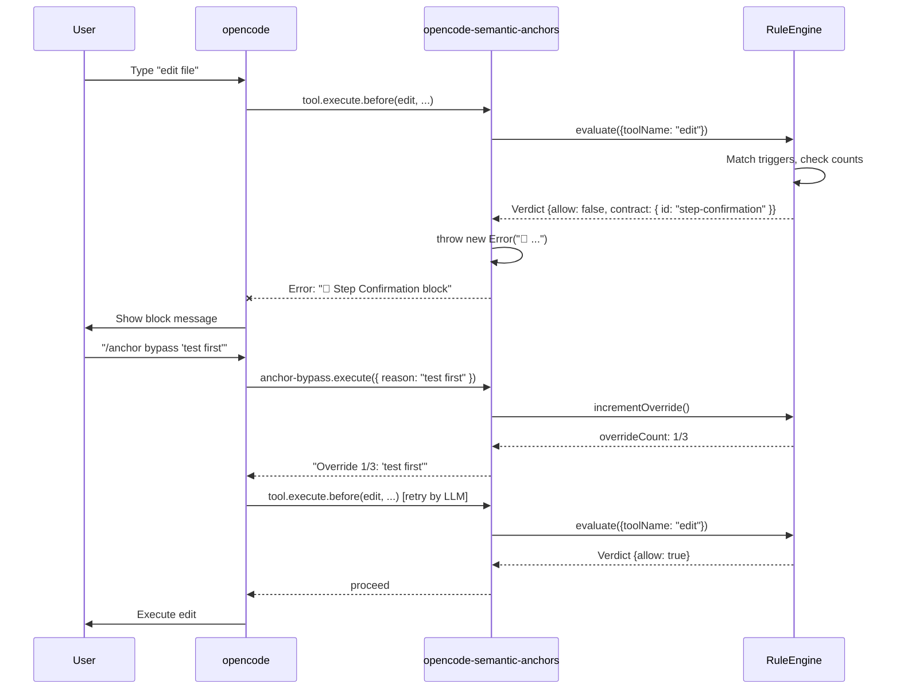
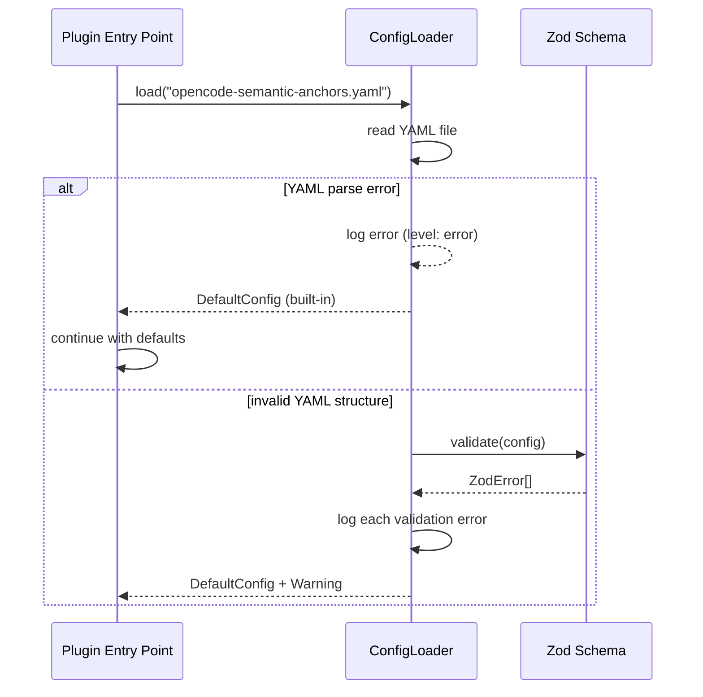
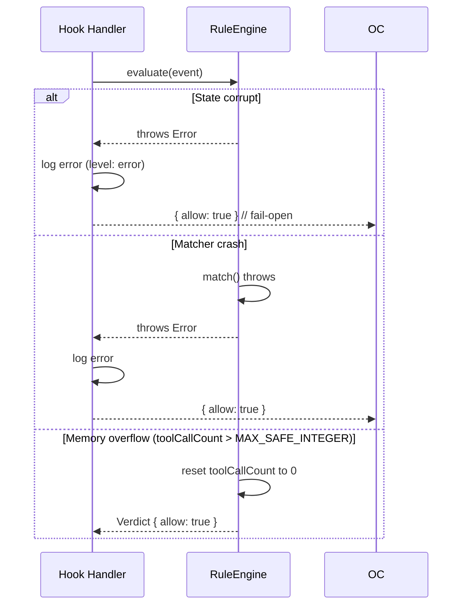
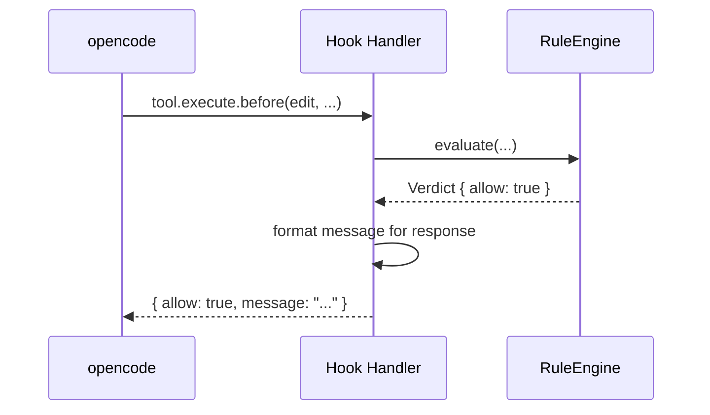

# 5. Building Block View

## Whitebox Overview



## Block: Plugin Entry Point (`plugin/opencode-semantic-anchors/src/index.ts`)

**Responsibility:** Registers hooks and tools with opencode. Initialises config and Rule Engine at load time.

**Interface:**
```typescript
import type { Plugin, tool } from '@opencode-ai/plugin'

export const opencodeSemanticAnchors: Plugin = async ({ client, $, directory, worktree }) => {
  // Config + RuleEngine are initialised here
  const config = await loadConfig()
  const engine = new RuleEngine(config)

  return {
    'tool.execute.before': async (input, output) => {
      const verdict = engine.evaluate({
        type: 'tool',
        toolName: input.tool,
        args: output.args,
      })

      if (!verdict.allow) {
        throw new Error(`🚫 ${verdict.message}`)
      }

      if (verdict.message) {
        await client.app.log({
          body: { service: 'opencode-semantic-anchors', level: 'warn', message: verdict.message }
        })
      }
    },

    tool: {
      'anchor-bypass': anchorBypassTool(engine),
      'anchor-status': anchorStatusTool(engine),
      'anchor-config-reload': anchorConfigReloadTool(config),
    },
  }
}
```

> **Source Anchor (source):** opencode Plugin SDK — Basic Structure (function-based API). https://opencode.ai/docs/plugins#basic-structure. "A plugin is a JavaScript/TypeScript module that exports one or more plugin functions. Each function receives a context object and returns a hooks object."
>
> **Note:** The `chat.message` and `agent.activate` hooks are not yet documented as standard hooks in the current plugin docs. They can be connected via the generic `event` system if needed. See https://opencode.ai/docs/plugins#events.

## Block: Config Layer

### `config/loader.ts` – YAML Loader

**Responsibility:** Liest `opencode-semantic-anchors.yaml` aus dem opencode Config-Verzeichnis, validiert gegen Schema, merged mit Role-based Presets.

**Interface:**
```typescript
interface ConfigLoader {
  load(): LoadedConfig           // Loads config + validates
  reload(): LoadedConfig         // Reloads (for /anchor config-reload)
  getActiveContracts(role: string): StructuralCouplingContract[]
}

interface LoadedConfig {
  contracts: StructuralCouplingContract[]
  presets: Record<string, string[]>  // role → contractIds[]
  settings: {
    maxOverrides: number
    stepConfirmationInterval: number
  }
}
```

### `config/schema.ts` – Zod Schema (Contract-Typisierung)

**Responsibility:** Validiert die YAML-Config gegen ein Zod-Schema. Stellt sicher, dass Contract-IDs existieren, Modes gültig sind, Trigger-Spezifikationen vollständig sind.

```typescript
import { z } from 'zod'

export const TriggerSpecSchema = z.object({
  type: z.enum(['tool', 'message', 'state']),
  pattern: z.string(),  // tool name pattern oder keyword regex
  count: z.number().optional(),  // für step confirmation
})

export const StructuralCouplingContractSchema = z.object({
  id: z.string().min(1),
  mode: z.enum(['BLOCK', 'WARN']),
  description: z.string(),
  anchorRefs: z.array(z.string()).optional(),  // optional: referenzierte Semantic Anchor-IDs
  triggers: z.array(TriggerSpecSchema).min(1),
  maxOverrides: z.number().default(3),
})

export const ConfigSchema = z.object({
  version: z.string().default('1'),
  contracts: z.array(StructuralCouplingContractSchema),
  presets: z.record(z.array(z.string())).optional(),  // role → contractIds[]
  settings: z.object({
    maxOverrides: z.number().default(3),
    stepConfirmationInterval: z.number().default(3),
  }).default({}),
})

// Derived types
export type StructuralCouplingContract = z.infer<typeof StructuralCouplingContractSchema>
```

## Block: Rule Engine

### `rules/engine.ts` – RuleEngine

**Responsibility:** Zentraler Evaluator. Nimmt Events (toolName, message, role) entgegen, matched gegen aktive Contracts, gibt Verdikt zurück.

**Interface:**
```typescript
class RuleEngine {
  constructor(config: LoadedConfig)
  
  evaluate(event: ToolEvent | MessageEvent): Verdict
  setRole(role: string): void
  getState(): SessionState
  getActiveContracts(): StructuralCouplingContract[]
  incrementOverride(): number  // returns new count
  reset(): void
}

interface Verdict {
  allow: boolean
  contract: StructuralCouplingContract | null
  message: string
  overrideTool?: string  // Tool-Name für Bypass
}

interface SessionState {
  role: string
  toolCallCount: number
  overrideCount: number
  maxOverrides: number
  lastConfirmation: Date | null
}
```

**Evaluation order:**
1. Check Step Confirmation Contract (toolCallCount % interval === 0 && no confirmation?)
2. Check active contracts against toolName/pattern
3. First match wins (priority order)
4. No match → ALLOW

### `rules/matcher.ts` – AnchorMatcher

**Responsibility:** Matcht Tool-Namen und Message-Keywords gegen Trigger-Patterns.

```typescript
class AnchorMatcher {
  match(toolName: string, triggers: TriggerSpec[]): TriggerSpec | null
  matchMessage(content: string, triggers: TriggerSpec[]): TriggerSpec | null
}
```

### `rules/presets.ts` – Role Presets

**Responsibility:** Definiert Default-Contracts pro Rolle. 12 Presets entsprechend der 12 Semantic-Anchors-Rollen.

> **Source Anchor (source):** Role definitions from the LLM-Coding/Semantic-Anchors repository.
> https://github.com/LLM-Coding/Semantic-Anchors/blob/main/docs/metadata/roles.yml. 12 roles: Software Developer, Architect, QA Engineer, DevOps Engineer, Product Owner, Business Analyst, Technical Writer, UX Designer, Data Scientist, Consultant, Team Lead, Educator.

```typescript
const ROLE_PRESETS: Record<string, StructuralCouplingContract[]> = {
  'software-developer': [
    // Step Confirmation, Source Anchor, Intent Anchor
  ],
  'software-architect': [
    // + Boundary Anchor, Emergence Anchor
  ],
  // ... 10 weitere Rollen
}
```

## Block: Hook Handlers

### `hooks/toolExecute.ts`

**Responsibility:** Triggert vor jeder Tool-Ausführung. Ruft `RuleEngine.evaluate()` auf. Bei BLOCK: `throw new Error()`. Bei WARN: loggt Warnung via `client.app.log()`.

```typescript
// tool.execute.before — wird im Plugin Entry Point als Hook registriert
export function createToolExecuteHandler(engine: RuleEngine) {
  return async (input: ToolExecuteInput, output: ToolExecuteOutput) => {
    const verdict = engine.evaluate({
      type: 'tool',
      toolName: input.tool,
      args: output.args,
    })

    if (!verdict.allow) {
      // BLOCK: opencode fängt den Throw und zeigt die Message
      throw new Error(`🚫 ${verdict.message}`)
    }

    if (verdict.message) {
      // WARN: loggen, Ausführung läuft weiter
      // (Logging via client.app.log — client ist im Plugin-Context verfügbar)
    }
  }
}
```

> **Source Anchor (Quelle):** opencode Plugin SDK — .env protection example. https://opencode.ai/docs/plugins#env-protection. "throw new Error()" in `tool.execute.before` blockt die Tool-Ausführung.

### `hooks/chatMessage.ts` (via Event-System)

**Responsibility:** Observiert Chat-Nachrichten. Erkennt fehlende Intent-Deklarationen, fehlende Quellenangaben, oder narrative statt BLUF-Struktur. Gibt sanfte Vorschläge (blockt nicht).

> **Note:** The current opencode plugin docs do not list a dedicated `chat.message` hook. Chat observation is instead done via the generic event system (`event` hook). See https://opencode.ai/docs/plugins#events → Message Events.

```typescript
// Als generisches Event registriert (anstatt dediziertem hook)
export function createMessageHandler(engine: RuleEngine) {
  return async ({ event }: { event: { type: string; content?: string } }) => {
    if (event.type !== 'message.updated') return

    // Prüfe auf fehlenden Intent bei Task-Beginn
    if (isNewTaskRequest(event) && !containsIntent(event.content)) {
      // Logging via client.app.log oder append to prompt
    }

    // Prüfe auf faktische Behauptungen ohne Quelle
    if (containsFactualClaim(event.content) && !containsSourceCitation(event.content)) {
      // Logging via client.app.log
    }
  }
}
```

### `hooks/agentRoleChange.ts` (via Session Events)

**Responsibility:** Lädt Role-based Preset beim Agent-Start oder Rollenwechsel.

> **Note:** The current opencode plugin docs do not list a dedicated `agent.activate` hook. Role changes can be detected via `session.updated` events. See https://opencode.ai/docs/plugins#events → Session Events.

```typescript
// agent.activate — via session Events
export function createRoleHandler(engine: RuleEngine, config: ConfigLoader) {
  return async ({ event }: { event: { type: string; session?: { role?: string } } }) => {
    if (event.type === 'session.created' || event.type === 'session.updated') {
      const role = event.session?.role || 'default'
      engine.setRole(role)
    }
  }
}
```

## Block: Custom Tools

### `tools/bypass.ts` – `/anchor bypass [reason]`

**Responsibility:** Erlaubt temporären Override eines aktiven BLOCKs. Zählt mit, loggt den Grund.

```typescript
// tools/bypass.ts — erzeugt eine Tool-Definition für den Plugin-Export
import { tool } from '@opencode-ai/plugin'

export function anchorBypassTool(engine: RuleEngine) {
  return tool({
    description: 'Temporarily bypass an active contract block',
    args: { reason: tool.schema.string() },
    async execute(args) {
      const state = engine.getState()
      if (state.overrideCount >= state.maxOverrides) {
        return `Error: Max overrides (${state.maxOverrides}) reached. Cannot bypass.`
      }
      const newCount = engine.incrementOverride()
      return `Override ${newCount}/${state.maxOverrides}: "${args.reason}"`
    },
  })
}
```

### `tools/status.ts` – `/anchor status`

**Responsibility:** Zeigt aktive Contracts, Zählerstände, Rolle.

```typescript
// tools/status.ts
import { tool } from '@opencode-ai/plugin'

export function anchorStatusTool(engine: RuleEngine) {
  return tool({
    description: 'Show active contracts, counters, role',
    args: {},
    async execute() {
      const state = engine.getState()
      return JSON.stringify(state, null, 2)
    },
  })
}
```

### `tools/configReload.ts` – `/anchor config-reload`

**Responsibility:** Lädt Config neu ohne Plugin-Neustart. Nur mit `edit`-Permission.

```typescript
// tools/configReload.ts
import { tool } from '@opencode-ai/plugin'

export function anchorConfigReloadTool(config: ConfigLoader) {
  return tool({
    description: 'Reload config without plugin restart (requires edit permission)',
    args: {},
    async execute() {
      config.reload()
      return 'Config reloaded'
    },
  })
}
```

## Datenfluss: Tool Execution (Blocking)



> **Take before Buy before Make:** This data flow follows the opencode Plugin SDK pattern: `throw new Error()` blocks the tool execution (see .env protection example, https://opencode.ai/docs/plugins#env-protection). The bypass mechanism uses a custom tool call that increments the override counter before the actual tool execution is retried.

## Error Handling

### Fail-Open Prinzip

On any error in a hook, the plugin returns **`{ allow: true }`** so that the agent is not blocked. This principle applies to all layers:

```
Error in Config Layer     → DefaultConfig + Warning Log
Error in RuleEngine       → allow: true + Error Log
Error in Hook Handler     → allow: true + Error Log
Error in Custom Tool      → Error Response to User
```

> **Rationale:** The plugin is a runtime steering tool, not a security layer. A blocking error would crash the entire opencode session. Fail-Open ensures Workflow Continuity (Quality Goal #3).
>
> **Source Anchor (source):** opencode Plugin SDK — .env protection example demonstrates that `throw new Error()` in `tool.execute.before` interrupts tool execution. Our Fail-Open catches this throw and returns `{ allow: true }`. See https://opencode.ai/docs/plugins#env-protection.

### Error scenarios per layer

#### 1. Config Layer — YAML Parse Error



**Behaviour:**
- Invalid YAML → Default configuration (Step Confirmation with 3-call interval)
- Error details are logged via `client.app.log({ level: "error" })`
- Plugin still starts — no blockade

**Affected interfaces:**
```typescript
// config/loader.ts
interface ConfigLoader {
  load(): LoadedConfig           // does not throw — always returns config
  // On error: DefaultConfig with log warning
}
```

#### 2. RuleEngine — Evaluation Error



**Behaviour:**
- Every throw in `evaluate()` is caught by the hook handler
- RuleEngine has no external dependencies (no HTTP calls, no DB) — error sources are only programming errors or state corruption
- `SessionState` is **not reset** on error (only `toolCallCount` on overflow)

**Affected interfaces:**
```typescript
// rules/engine.ts
class RuleEngine {
  evaluate(event: ToolEvent | MessageEvent): Verdict
  // Guarantee: evaluate() does not throw externally.
  // Internal errors are logged, return value is always Verdict.
}
```

#### 3. Hook Handler — Execution Error



**What happens when there is a bug in the hook handler itself:**
- opencode catches the throw and treats the hook as failed
- Tool execution still proceeds (opencode's own fail-open)
- Plugin has no way to log the error (since the handler itself crashes)

> **Source Anchor (source):** The opencode Plugin SDK does not explicitly document how opencode handles throwing hooks. The `.env protection` code (https://opencode.ai/docs/plugins#env-protection) shows `throw new Error()` as a legitimate way to block — so opencode catches the throw and interprets it as a block. Our Fail-Open ensures we do NOT accidentally block.

#### 4. Custom Tools — Bypass Max Overrides

```typescript
// tools/bypass.ts
handler: async (args) => {
  const state = ruleEngine.getState()
  if (state.overrideCount >= state.maxOverrides) {
    return { error: `Max overrides (${state.maxOverrides}) reached. Cannot bypass.` }
  }
  const newCount = ruleEngine.incrementOverride()
  return { message: `Override ${newCount}/${state.maxOverrides}: "${args.reason}"` }
}
```

Only defined error path in Custom Tools. The `maxOverrides` check prevents infinite bypasses.

### Logging-Strategie

| Layer | Method | Details | PII |
|-------|--------|---------|-----|
| Config Layer | `client.app.log({ level: "warn"|"error" })` | Parse errors, validation errors | No |
| RuleEngine | `client.app.log({ level: "error" })` | State corruption, matcher errors | No |
| Hook Handler | `client.app.log({ level: "warn" })` | Verdict results (allow/block) | No (toolName only) |
| Custom Tools | Return value to user | Override counters, error messages | No |

> **Source Anchor (source):** opencode Plugin SDK — Logging API. https://opencode.ai/docs/plugins#logging. "Use `client.app.log()` instead of `console.log` for structured logging."

### Graceful Degradation per component

| Component | Total failure | Partial failure |
|-----------|-------------|-----------------|
| Config Layer | DefaultConfig (built-in) | Settings field missing → default value |
| RuleEngine | allow: true + Error Log | One contract broken → other contracts run |
| Hook Handler | allow: true (opencode catches throw) | Message formatting broken → allow: true without message |
| Custom Tools | Error response to user | One tool broken → other tools run |

### Error Handling Architecture Summary

```
                    ┌─────────────────┐
                    │   opencode       │
                    │  (ruft Hook auf) │
                    └────────┬────────┘
                             │ tool.execute.before
                             ▼
                    ┌─────────────────┐
                    │  Hook Handler   │
                    │  try {          │
                    │    evaluate()   │
                    │  } catch(e) {   │
                    │    log.error(e) │
                    │    return ALLOW │  ← Fail-Open
                    │  }              │
                    └────────┬────────┘
                             │ evaluate()
                             ▼
                    ┌─────────────────┐
                    │  RuleEngine     │
                    │  try {          │
                    │    match()      │
                    │  } catch(e) {   │
                    │    log.error(e) │
                    │    return ALLOW │  ← Fail-Open
                    │  }              │
                    └─────────────────┘
```

Fail-Open auf zwei Ebenen: Hook Handler fängt RuleEngine-Fehler, und opencode selbst fängt Hook-Fehler. Double layer of protection gegen Session-Blockade.
