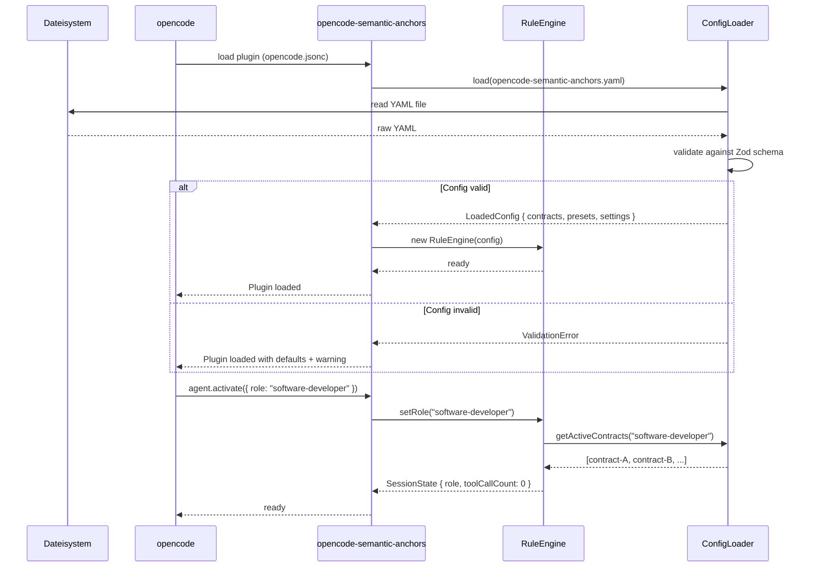
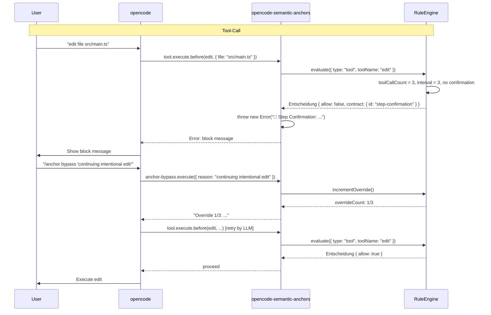
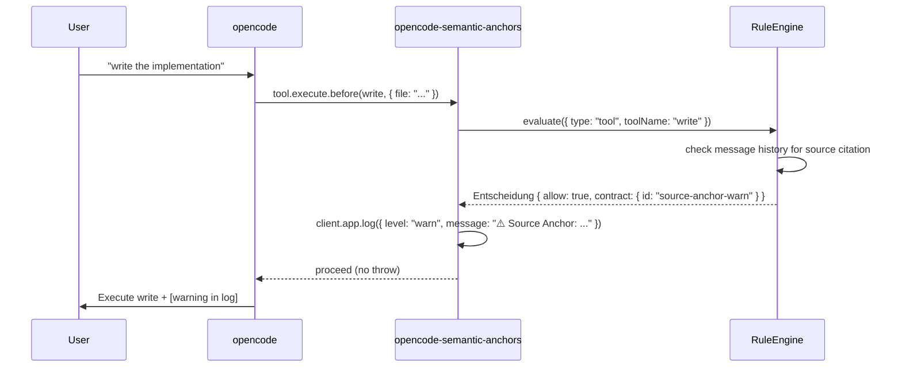
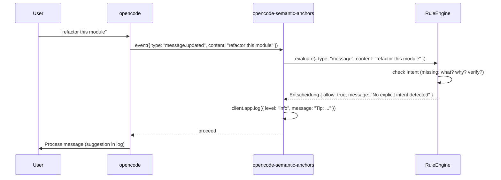
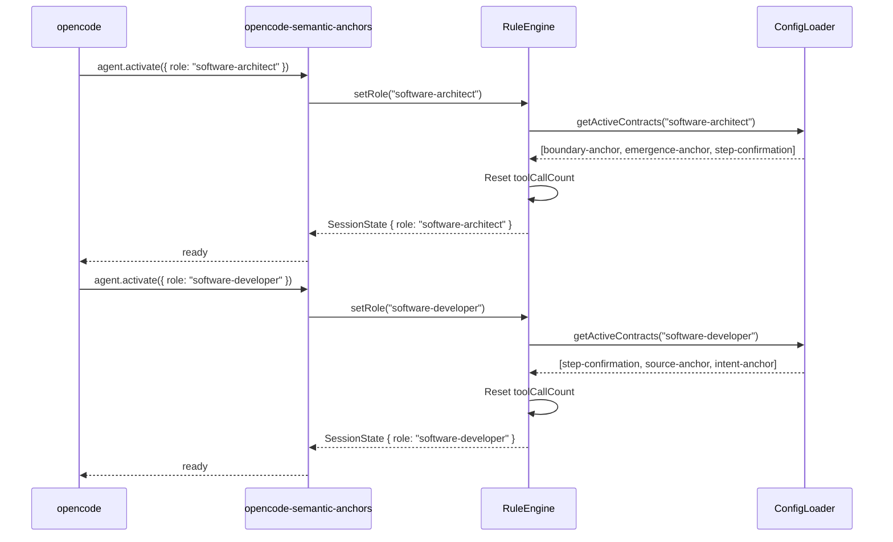
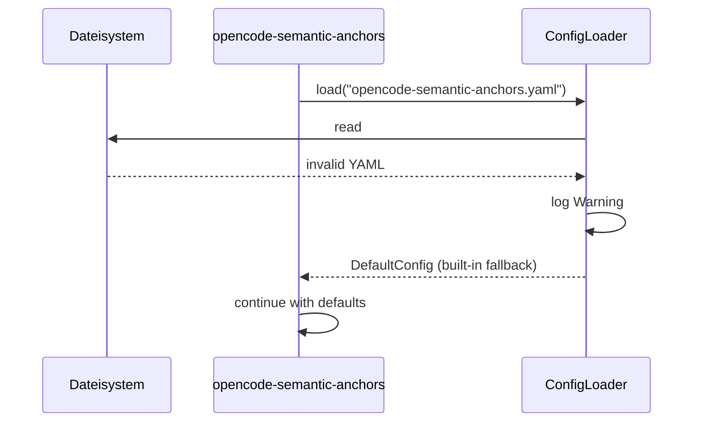
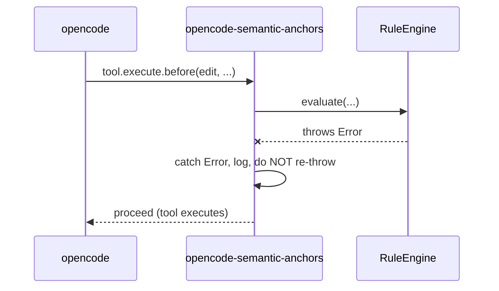
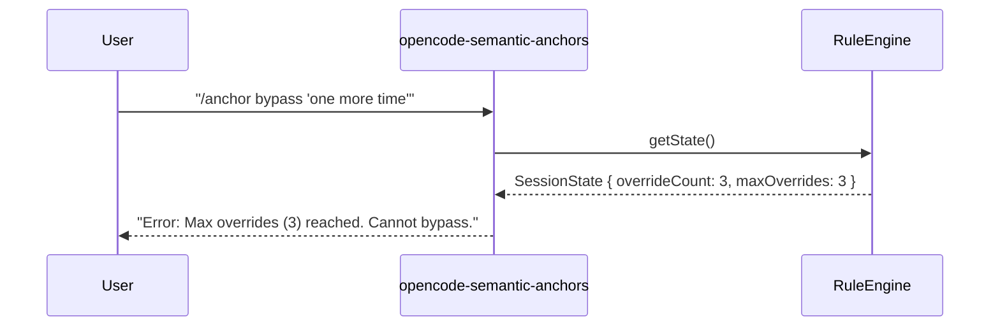

# 6. Laufzeitsicht

## Startsequenz

## Tool-Ausführung: Blocked Path

Tritt ein, wenn ein aktiver Contract einen BLOCK auslöst (z. B. Step Confirmation nach 3 Tool-Aufrufen ohne "Weiter?"):

## Tool-Ausführung: Warn-Pfad

Tritt ein, wenn ein Contract im WARN-Mode matcht (z. B. Source Anchor bei `write` ohne vorherige Quellenangabe):

## Chat-Nachrichtenfluss

Kein Blocking, nur Hinweise:

## Agenten-Rollenwechsel

## Fehlerszenarien

### Config-Validierungsfehler

### Hook-Fehlerwurf

> **Fail-Open-Prinzip:** Bei jedem Fehler in einem Hook gibt das Plugin `{ allow: true }` zurück, damit der Agent nicht blockiert wird. Der Fehler wird geloggt. Dieses Verhalten ist in `05-building-block-view.md` Abschnitt "Error Handling" spezifiziert (vier Szenarien: Config/RuleEngine/Hook/Tool).

## Override-Maximum erreicht

## Session-Reset (Plugin-Neuladung)

Bei Plugin-Neuladung (z. B. nach Config-Änderung + `/anchor config-reload`):

1. ConfigLoader liest YAML erneut
2. Validiert gegen Zod-Schema
3. RuleEngine wird mit neuer Config initialisiert
4. SessionState wird zurückgesetzt (toolCallCount = 0, overrideCount = 0)
5. Rolle bleibt erhalten (sofern gesetzt)
