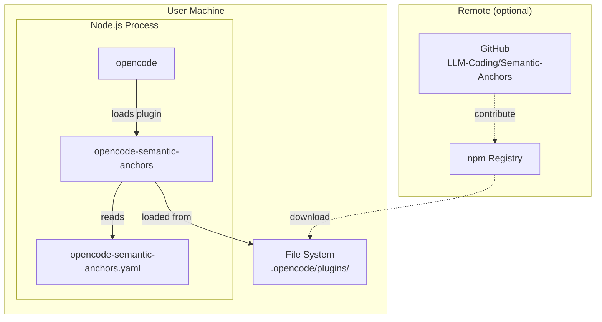
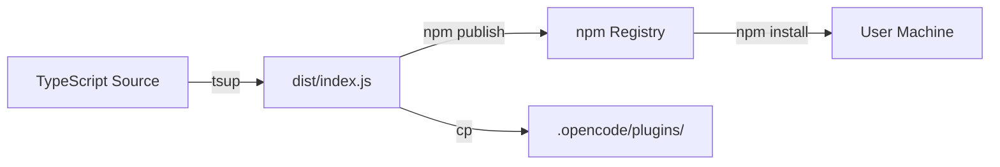

# 7. Deployment-Sicht

## 7.1 Infrastrukturlandschaft

Das Plugin hat einen **minimalen Infrastruktur-Footprint**. Es läuft vollständig innerhalb des opencode-Prozesses auf dem Rechner des Benutzers:



> **Source Anchor (Quelle):** opencode Plugin Installation Guide: https://opencode.ai/docs/plugins#use-a-plugin. "Place JavaScript or TypeScript files in the plugin directory. `.opencode/plugins/` - Project-level plugins. `~/.config/opencode/plugins/` - Global plugins."

### Deployment-Diagramm (C4)

```mermaid
C4Deployment
  Person(user, "User", "Developer using opencode")

  Deployment_Node(machine, "User Machine", "Linux/macOS/Windows") {
    Deployment_Node(node, "Node.js Runtime", "Bun or Node.js") {
      Deployment_Node(opencode, "opencode Application", "v0.59+") {
        Container(plugin, "opencode-semantic-anchors", "TypeScript/JavaScript", "Plugin loaded at startup")
      }
    }
    Deployment_Node(fs, "File System") {
      Component(config, "opencode-semantic-anchors.yaml", "YAML", "Steering rules")
      Component(pluginDir, ".opencode/plugins/", "Directory", "Plugin source files")
    }
  }

  Rel(user, opencode, "Uses CLI/TUI")
  Rel(opencode, plugin, "Loads via plugin hook")
  Rel(plugin, config, "Reads at startup")
```

## 7.2 Laufzeitumgebung

| Aspekt | Spezifikation | Quelle |
|--------|--------------|--------|
| Runtime | **Node.js ≥ 18** oder **Bun** (opencode-Runtime) | opencode läuft auf Node.js oder Bun |
| Prozess | **Single Process** — Plugin wird als Modul in opencode geladen | opencode Plugin SDK |
| Betriebssystem | Linux, macOS, Windows (opencode-Support) | opencode plattformunabhängig |
| Start | **Lazy** — Plugin wird beim ersten Hook-Aufruf initialisiert | Plugin SDK Lifecycle |
| Speicher | **In-Memory only** — Session-State lebt im RAM, keine Persistenz | Architecture Constraint |
| Netzwerk | **Zero outbound** — keine externen HTTP-Aufrufe | Architecture Constraint |

> **Source Anchor (Quelle):** opencode Systemvoraussetzungen. https://opencode.ai/docs. opencode unterstützt Linux, macOS und Windows. Läuft auf Node.js und Bun.

### Prozessarchitektur

```
┌─────────────────────────────────────────────────────────────┐
│               Node.js / Bun-Prozess                          │
│                                                              │
│  ┌──────────────────────────────────────────────────────┐    │
│  │                  opencode                              │    │
│  │  ┌────────────────────────────────────────────────┐  │    │
│  │  │         Plugin Isolation Boundary               │  │    │
│  │  │  ┌──────────────────┐  ┌──────────────────┐   │  │    │
│  │  │  │ Config Layer     │  │ RuleEngine       │   │  │    │
│  │  │  │ (YAML Loader)    │  │ (evaluate, match) │   │  │    │
│  │  │  └──────────────────┘  └──────────────────┘   │  │    │
│  │  │  ┌──────────────────┐  ┌──────────────────┐   │  │    │
│  │  │  │ Hook Handler     │  │ Custom Tools     │   │  │    │
│  │  │  │ (tool.execute)   │  │ (bypass, status) │   │  │    │
│  │  │  └──────────────────┘  └──────────────────┘   │  │    │
│  │  └────────────────────────────────────────────────┘  │    │
│  └──────────────────────────────────────────────────────┘    │
└─────────────────────────────────────────────────────────────┘
```

## 7.3 Deployment-Optionen

### Option 1: Lokales Plugin-Verzeichnis (v1 — aktuell)

```
~/.config/opencode/
├── opencode.jsonc              # Plugin-Registrierung
├── plugins/
│   └── opencode-semantic-anchors/
│       ├── package.json
│       ├── dist/
│       │   └── index.js        # Kompilierter Output
│       └── opencode-semantic-anchors.yaml  # Default-Config
└── opencode-semantic-anchors.yaml          # User-Config (override)
```

**Installation:**
```bash
# 1. Ins Plugin-Verzeichnis klonen
git clone https://github.com/LLM-Coding/Semantic-Anchors.git
cp -r Semantic-Anchors/plugins/opencode-semantic-anchors ~/.config/opencode/plugins/

# 2. Abhängigkeiten installieren
cd ~/.config/opencode/plugins/opencode-semantic-anchors && npm install

# 3. In opencode.jsonc registrieren
# (Plugin-Verzeichnis wird automatisch geladen — keine Registrierung nötig)
```

> **Source Anchor (Quelle):** opencode — From local files. https://opencode.ai/docs/plugins#from-local-files. "Place JavaScript or TypeScript files in the plugin directory. Files in these directories are automatically loaded at startup."

### Option 2: npm-Paket (v2 — zukünftig)

```
npm install -g @semantic-anchors/opencode-plugin
```

**Registrierung in `opencode.jsonc`:**
```jsonc
{
  "plugins": ["@semantic-anchors/opencode-plugin"]
}
```

> **Source Anchor (Quelle):** opencode — From npm. https://opencode.ai/docs/plugins#from-npm. "Specify npm packages in your config file. Both regular and scoped npm packages are supported."

### Option 3: Projekt-lokale Installation

Für team-spezifische Steering-Regeln kann das Plugin auch pro Projekt installiert werden:

```
my-project/
├── .opencode/
│   ├── plugins/
│   │   └── opencode-semantic-anchors/    # Plugin-Code
│   └── opencode-semantic-anchors.yaml     # Projekt-Config
└── opencode.jsonc
```

> **Source Anchor (Quelle):** opencode Load order. https://opencode.ai/docs/plugins#load-order. "Project config (opencode.json) → Project plugin directory (.opencode/plugins/)."

## 7.4 Config-Deployment

### Config-Datei-Pfade (Priorität)

| Priorität | Pfad | Anwendungsfall | Überschreibung |
|----------|-------|---------------|----------------|
| 1 | `$PROJECT/.opencode/opencode-semantic-anchors.yaml` | Projektspezifische Regeln | Überschreibt User-Config |
| 2 | `~/.config/opencode/opencode-semantic-anchors.yaml` | User-globale Defaults | Überschreibt Built-in |
| 3 | `plugins/opencode-semantic-anchors/dist/defaults.yaml` | Built-in Defaults | Fallback |

### Config-Reload ohne Plugin-Neustart

Das `/anchor config-reload` Tool erlaubt das Neuladen der Config zur Laufzeit:
- Liest YAML erneut von der Festplatte
- Validiert gegen Zod-Schema
- Aktualisiert die RuleEngine mit neuen Contracts
- SessionState (overrideCount, toolCallCount) wird **nicht** zurückgesetzt

## 7.5 Distributions-Pipeline

### Build & Paketierung



| Stufe | Tool | Ausgabe |
|-------|------|---------|
| Kompilieren | `tsup` (oder `tsc`) | `dist/index.js` (CommonJS) |
| Typdefinitionen | `tsc --declaration` | `dist/index.d.ts` |
| Paketieren | `npm pack` | `opencode-semantic-anchors-X.Y.Z.tgz` |
| Veröffentlichen | `npm publish` | `@semantic-anchors/opencode-plugin` |

> **Source Anchor (Quelle):** tsup documentation: https://tsup.egoist.dev/. "Bundle your TypeScript library with no configuration."

### Paket-Inhalt (npm)

```
@semantic-anchors/opencode-plugin
├── dist/
│   ├── index.js            # Kompilierter Plugin-Code
│   ├── index.d.ts          # TypeScript-Typdefinitionen
│   └── defaults.yaml       # Built-in Config (im Bundle)
├── package.json
├── README.md
├── LICENSE (MIT)
└── CHANGELOG.md
```

### Versionskompatibilität

| Plugin-Version | opencode-Version | API-Änderungen |
|---------------|-----------------|---------------|
| 0.x (alpha) | 0.59+ | Plugin API (funktionsbasiert) |
| 1.0.0 | 0.60+ | Stabiler Release |
| 2.0.0 | 1.0+ | Mögliche Breaking Changes |

## 7.6 Deployment-Grenzen

### Innerhalb des Scopes (WIRD deployt)

| Artefakt | Verteilung | Enthalten |
|----------|-----------|-----------|
| Plugin Bundle | npm / lokal | `dist/index.js` + Typdefinitionen |
| Default-Config | Im Bundle | `defaults.yaml` (Step-Confirmation + Role-Presets) |
| Dokumentation | npm / GitHub | README, CHANGELOG, LICENSE |

### Außerhalb des Scopes (WIRD NICHT deployt)

| Nicht deployt | Begründung |
|---------------|-----------|
| **Server / Service** | Keine Server-Komponente — läuft embedded in opencode |
| **Datenbank** | Session-State ist In-Memory, kein DB-Schema |
| **Docker-Container** | Kein Container-Deployment notwendig |
| **Kubernetes / Helm** | Kein Orchestrierungsbedarf |
| **API Gateway / Load Balancer** | Keine Netzwerk-Komponenten |
| **Monitoring / Logging-Infrastruktur** | Nutzt opencode-internes `client.app.log()` |
| **CI/CD Pipeline** | Nicht Teil des Deployments (nur für Entwicklung) |

### Sicherheit beim Deployment

| Aspekt | Massnahme |
|--------|-----------|
| **Integrität npm** | `package-lock.json`, Signatur-Verifikation (npm v10+) |
| **Lokale Installation** | Kein Risiko (user-owned directory) |
| **Config-Datei** | Leserechte nur für User (Dateisystem-Berechtigungen) |
| **Plugin-Updates** | `npm outdated` + Renovate für Dependency-Sicherheit |

> **Source Anchor (Quelle):** npm registry integrity. https://docs.npmjs.com/about-registry-integrity-and-signatures. Siehe auch `docs/08-Konzepte/03-security.md` (Supply Chain Security).

## 7.7 Load Order & Start-Sequenz

Beim Start von opencode:

```
1. opencode startet Node.js/Bun-Prozess
2. opencode liest opencode.jsonc → Plugin-Definitionen
3. opencode scannt .opencode/plugins/ → lokale Plugins
4. Plugin wird geladen (import/require)
5. Plugin-Factory wird aufgerufen: Plugin = async (ctx) => { ... }
6. ConfigLoader liest opencode-semantic-anchors.yaml
7. RuleEngine wird mit Config initialisiert
8. Hooks und Tools werden bei opencode registriert
9. Plugin ist aktiv — wartet auf Tool-Aufrufe
```

> **Source Anchor (Quelle):** opencode Load order. https://opencode.ai/docs/plugins#load-order. "Plugins are loaded from all sources and all hooks run in sequence."
