# 10. Qualitätsanforderungen

## 8.1 Qualitätsbaum

Der Qualitätsbaum leitet sich aus den Qualitätszielen (Abschnitt 1) ab und bricht sie in messbare Untermerkmale herunter. Basierend auf ISO 25010.

```mermaid
graph TB
  Q[Plugin-Qualität] --> F1[Funktionale Korrektheit]
  Q --> F2[Performance-Effizienz]
  Q --> F3[Kompatibilität]
  Q --> F4[Bedienbarkeit]
  Q --> F5[Zuverlässigkeit]
  Q --> F6[Sicherheit]

  F1 --> F1a[Steering-Correctness<br/>BLOCK-Mode ignoriert nie stillschweigend]
  F1 --> F1b[Zuverlässigkeit<br/>Determinismus + Reproduzierbarkeit + Nachvollziehbarkeit]
  F1 --> F1c[Kontexteffizienz<br/>Kein Context-Token-Verbrauch]

  F2 --> F2a[Antwortzeit<br/>Hook-Prüfungen <50ms]
  F2 --> F2b[Ressourcennutzung<br/>Kein zusätzlicher RAM/CPU außerhalb von Hooks]

  F3 --> F3a[Plugin-Koexistenz<br/>Kein gemeinsam veränderlicher Zustand]
  F3 --> F3b[Prompt-Kompatibilität<br/>Koexistiert mit AGENTS.md]

  F4 --> F4a[Konfigurationsklarheit<br/>YAML, Presets decken 90% ab]
  F4 --> F4b[Fehlerdiagnose<br/>Logs zeigen, warum ein Block/Warn ausgelöst wurde]

  F5 --> F5a[Graceful Degradation<br/>Fail-Open bei Fehlern]
  F5 --> F5b[Verfügbarkeit<br/>Plugin-Absturz darf opencode nicht abstürzen lassen]

  F6 --> F6a[Kein Datenleck<br/>Keine externen HTTP-Aufrufe]
  F6 --> F6b[Keine PII in Logs<br/>Tool-Argumente werden nicht geloggt]
```

> **Source Anchor (Quelle):** ISO 25010 Qualitätsmodell. https://www.iso.org/standard/35733.html. Unterteilt Softwarequalität in 8 Hauptkategorien (Functional Suitability, Performance Efficiency, Compatibility, Usability, Reliability, Security, Maintainability, Portability).

## 8.2 Qualitätsszenarien

Jedes Qualitätsziel wird durch ein konkretes Qualitätsszenario spezifiziert (Quelle: arc42-Vorlage, nach Bosch/ATAM).

### Szenario 1: Steering-Correctness

| Element | Beschreibung |
|---------|-------------|
| **Quelle** | Benutzer (oder bösartiger Agent) |
| **Auslöser** | Führt einen Tool-Aufruf aus, der einen aktiven BLOCK-Contract verletzt (z. B. Step Confirmation nach 3 Aufrufen) |
| **Umgebung** | Normale opencode-Session, Plugin aktiv, Contract im BLOCK-Mode |
| **Komponente** | `tool.execute.before` Hook |
| **Reaktion** | Hook wirft `new Error()`, opencode zeigt Block-Meldung |
| **Messkriterium** | 100% der Verstöße werden blockiert. Kein stillschweigendes Ignorieren. Messbar durch Tests. |

### Szenario 2: Zuverlässigkeit (Determinismus + Reproduzierbarkeit + Nachvollziehbarkeit)

| Element | Beschreibung |
|---------|-------------|
| **Quelle** | Benutzer |
| **Auslöser** | Lädt dieselbe opencode-Session zweimal mit identischer Konfiguration |
| **Umgebung** | Gleiche Plugin-Version, gleiche opencode-Version |
| **Komponente** | RuleEngine, Logging |
| **Reaktion** | **(Determinismus)** Gleiche Tool-Aufruf-Sequenz → gleiche Entscheidungen (allow/block). **(Reproduzierbarkeit)** Session-Wiederholung mit identischem Input erzeugt identischen Output. **(Nachvollziehbarkeit)** Log zeigt den auslösenden Contract inklusive Regel-Status für jede Entscheidung. |
| **Messkriterium** | 100% Reproduzierbarkeit bei gleichem Input (getestet durch deterministische Testsuite ohne LLM-Beteiligung). Jeder Block/Warn ist aus dem Log nachvollziehbar. |

### Szenario 3: Workflow-Kontinuität

| Element | Beschreibung |
|---------|-------------|
| **Quelle** | Benutzer (oder Agent, Plugin-Fehler) |
| **Auslöser** | Plugin wirft unerwarteten Fehler (Config-Parse-Fehler, RuleEngine-Absturz) |
| **Umgebung** | opencode-Session mit fehlerhafter Konfiguration oder Bug im Plugin |
| **Komponente** | Plugin (alle Schichten) |
| **Reaktion** | Fail-Open: Tool wird ausgeführt, Fehler wird geloggt. Kein Session-Abbruch. |
| **Messkriterium** | 100% der Hook-Fehler resultieren in `allow` (kein throw). Gemessen durch Injektion von Fehlern in der Testsuite. |

### Szenario 4: Konfigurationsklarheit

| Element | Beschreibung |
|---------|-------------|
| **Quelle** | Neuer Benutzer |
| **Auslöser** | Liest die Konfigurationsdatei und möchte eine neue Regel hinzufügen |
| **Umgebung** | Lokale Konfiguration (`opencode-semantic-anchors.yaml`) |
| **Komponente** | ConfigLayer |
| **Reaktion** | Benutzer kann in <5 Minuten eine neue Regel definieren, ohne Dokumentation konsultieren zu müssen |
| **Messkriterium** | Bedienbarkeitstest: 80% der neuen Benutzer schaffen eine Regel-Erweiterung in <5 Minuten |

### Szenario 5: Komponierbarkeit

| Element | Beschreibung |
|---------|-------------|
| **Quelle** | Benutzer |
| **Auslöser** | Installiert ein zweites opencode-Plugin neben opencode-semantic-anchors |
| **Umgebung** | opencode mit zwei aktiven Plugins |
| **Komponente** | Plugin-Einstiegspunkt |
| **Reaktion** | Beide Plugins laufen ohne Konflikte. Kein gemeinsam veränderlicher Zustand. |
| **Messkriterium** | Integrationstest: opencode startet mit beiden Plugins, beide Hooks feuern korrekt. |

### Szenario 6: Kontexteffizienz

| Element | Beschreibung |
|---------|-------------|
| **Quelle** | Benutzer (oder LLM-Agent) |
| **Auslöser** | Führt eine Session mit aktiven Steuerungs-Contracts aus |
| **Umgebung** | opencode-Session mit 10 aktiven Contracts, Plugin aktiv |
| **Komponente** | Plugin (Hooks) vs. System Prompt |
| **Reaktion** | Das LLM-Context-Fenster enthält KEINE Steuerungsregeln. Regeln werden ausschließlich über Plugin-Hooks zur Laufzeit ausgewertet. |
| **Messkriterium** | System-Prompt-Größe ist identisch mit/ohne aktive Contracts. Keine zusätzlichen Token für Steuerung. Verifiziert durch Inspektion des System-Prompts. |

### Szenario 7: Graceful Degradation

| Element | Beschreibung |
|---------|-------------|
| **Quelle** | Plugin-Fehler (ein einzelner Contract ist fehlerhaft) |
| **Auslöser** | Konfiguration enthält 5 Contracts, einer davon hat ein ungültiges Trigger-Muster |
| **Umgebung** | opencode startet mit fehlerhafter Konfiguration |
| **Komponente** | ConfigLoader |
| **Reaktion** | 4 gültige Contracts werden geladen, 1 fehlerhafter Contract wird geloggt und ignoriert. Plugin startet trotzdem. |
| **Messkriterium** | 100% der gültigen Contracts sind aktiv. Fehlerhafter Contract ist im Log sichtbar. |

## 8.3 ISO 25010 Zuordnung

| ISO 25010 Kategorie | Relevante Qualitätsziele | Messung |
|--------------------|------------------------|------------|
| **Functional Suitability** | Steering-Correctness (#1), Zuverlässigkeit (#2) | Testsuite: 100% Block-Rate bei Verstößen |
| **Performance Efficiency** | Workflow-Kontinuität (#3) — <50ms | Benchmark: Hook-Latenz <50ms über 1000 Durchläufe |
| **Compatibility** | Komponierbarkeit (#5) | Integrationstest: Koexistenz mit 2 anderen Plugins |
| **Usability** | Konfigurationsklarheit (#4) | Bedienbarkeitstest: 80% der Benutzer in <5 Minuten |
| **Reliability** | Graceful Degradation (Fail-Open) | Fehlerinjektionstest: 100% allow bei Fehlern |
| **Security** | Kein Datenleck, Keine PII in Logs | Code-Review + Abhängigkeitsscan |
| **Maintainability** | (implizit durch Tests + ADRs) | Testabdeckung >80% |
| **Portability** | (nicht relevant — opencode-spezifisch) | |

> **Source Anchor (Quelle):** ISO 25010:2011 Systems and software Quality Requirements and Evaluation (SQuaRE). https://www.iso.org/standard/35733.html. Die 8 Qualitätskategorien sind dort definiert.

## 8.4 Verifikation der Qualitätsziele

| Qualitätsziel | Verifiziert durch | Abnahmekriterium |
|-------------|------------|---------------------|
| Steering-Correctness | Unit-Tests (RuleEngine) | 100% der Test-Contracts werden korrekt ausgewertet |
| Zuverlässigkeit (Determinismus) | Deterministische Testsuite | Gleicher Input → gleiche Entscheidung (1000 Durchläufe) |
| Zuverlässigkeit (Reproduzierbarkeit) | Session-Wiederholungstest | Identischer Input → identischer Output |
| Zuverlässigkeit (Nachvollziehbarkeit) | Log-Inspektion | Jeder Block/Warn hat Contract-ID und Regel-Status im Log |
| Workflow-Kontinuität | Fail-Open-Integrationstest | Kein Session-Absturz bei injizierten Fehlern |
| Konfigurationsklarheit | Config-Beispiele + Zod-Validierung | Validierungsfehler geben klare Meldungen |
| Komponierbarkeit | Multi-Plugin-Integrationstest | opencode startet mit 3 Plugins ohne Konflikt |
| Kontexteffizienz | System-Prompt-Inspektion | Prompt-Größe identisch ohne/mit Plugin |

## 8.5 Teststrategie

### Umfang
| Ebene | Was | Werkzeug | Ort |
|-------|------|---------|----------|
| **Unit** | Einzelnes Modul isoliert (RuleEngine, Matcher, ConfigLoader) | vitest | `src/**/__tests__/*.test.ts` |
| **Integration** | Modulinteraktion (ConfigLoader → RuleEngine → Hook) | vitest | `src/**/__tests__/*.integration.test.ts` |
| **Fail-Open** | Fehlerinjektion in jeder Schicht → muss allow zurückgeben | vitest + Fixtures | `src/**/__tests__/*.failopen.test.ts` |

### Testdaten
- **Fixtures** (bevorzugt): Echte YAML-Dateien in `src/**/__fixtures__/` — geladen durch ConfigLoader oder direkt geparst
- **Mocks** (nur wenn unvermeidbar): Netzwerkaufrufe, Dateisystem (für Nicht-ConfigLoader-Module)

### Abdeckungsziele
| Metrik | Ziel |
|--------|--------|
| Statements | >80% |
| Branches | >80% |
| Functions | >80% |
| Lines | >80% |

### TDD-Anforderung
Jedes neue Feature-Modul folgt Test-Driven Development:
1. Test schreiben (schlägt fehl)
2. Modul implementieren (besteht)
3. Bei Bedarf refaktorisieren
4. Comitten

### CI-Integration (geplant)
| Schritt | Werkzeug |
|------|------|
| Typprüfung | `tsc --noEmit` |
| Lint (zukünftig) | `biome check` |
| Unit-Tests | `vitest run` |
| Abdeckung | `vitest run --coverage` |

## 8.6 Semantic Anchor Selbstverifikation

Das Plugin selbst muss durch seine eigenen Semantic Anchors verifizierbar sein — das Design erfüllt jeden Anchor wie folgt:

| Anchor | Wie erfüllt |
|--------|-------------------|
| Intent Anchor | Jede Regel hat ein `description`-Feld, das erklärt, was sie durchsetzt |
| Negative Anchor | Die Konfiguration listet explizit `excludedTools` pro Aufgaben-Typ |
| Verification Anchor | Plugin-Selbsttest: `vitest run` verifiziert, dass jede Regel korrekt auslöst |
| Source Anchor | Code-Kommentare zitieren die entsprechende Anchor-Definition aus dem Semantic-Anchors-Repository |
| Step Confirmation Anchor | Plugin erzwingt Step Confirmation auf Tool-Ebene — das Design selbst folgt Step Confirmation (jeder Abschnitt vor Fortfahren geprüft) |
| BLUF | Hook-Handler-Funktionen beginnen mit der Entscheidung, dann folgt die Implementierung |

> **Source Anchor (Quelle):** Die sechs hier verwendeten Semantic Anchors sind im LLM-Coding/Semantic-Anchors-Repository definiert. Siehe die Anchor-Vorlagen unter `docs/anchors/_template.adoc` in diesem Repository. Die spezifischen Anchor sind: Intent Anchor (testbar formulieren), Negative Anchor (explizite Verbote), Verification Anchor (Rückwärtsrekonstruktion), Source Anchor (wörtlich zitierte Quelle), Step Confirmation Anchor (ein Schritt nach dem anderen) und BLUF (Ergebnis zuerst).

## 8.7 Leistungskennzahlen

| Metrik | Ziel | Gemessen bei |
|--------|--------|-------------|
| Hook-Ausführung | <50ms pro Aufruf | `performance.now()` im Hook-Handler |
| Config-Laden | <200ms (einmalig beim Start) | Plugin-Startsequenz |
| Speicher | <5MB für Regeldefinitionen + Session-Status | Prozess-Heap-Messung |
